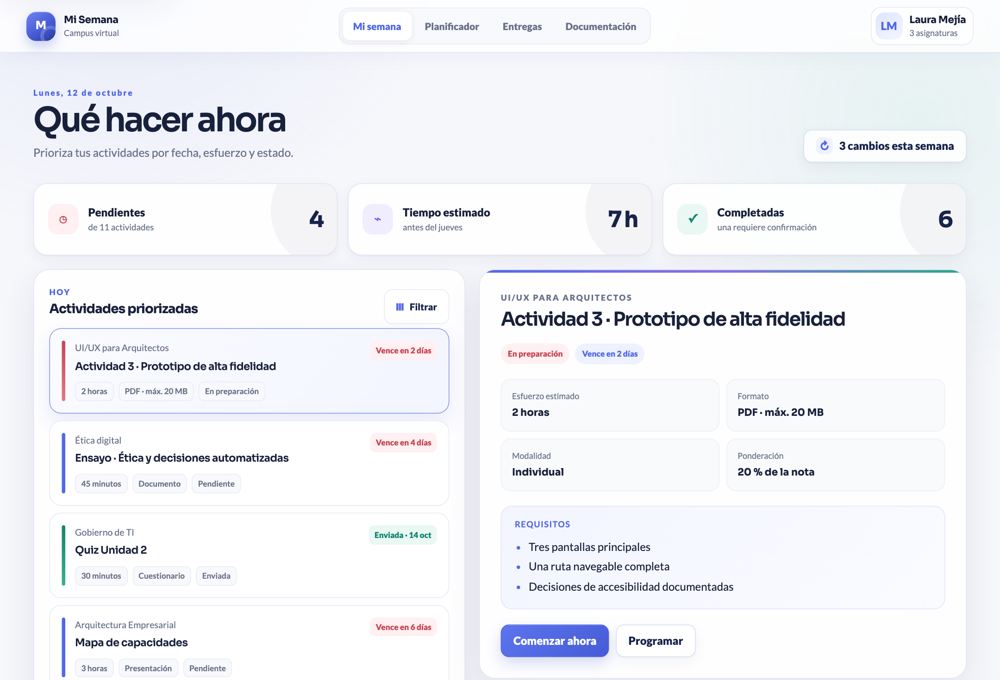

# Mi Semana - Prototipo UI/UX

Prototipo navegable desarrollado por el Grupo 04 para la actividad evaluativa de la Unidad 4 del curso UI/UX para Arquitectos.

## Prototipo

- [Abrir el prototipo navegable](https://yerlinmatu.github.io/mi-semana-prototipo-uiux/)
- [Consultar el entregable en PDF](docs/Entregable_UIUX_Mi_Semana_Grupo_04.pdf)

## Integrantes

- Yerlinson Maturana Serna
- Brayan Estif Calderón Gómez
- Sadane Gerónimo Miguel Santiago Acevedo Virgüés
- Julián Camilo Corredor Rojas

## Propuesta

Mi Semana consolida actividades académicas, ayuda a priorizar la siguiente acción y diferencia claramente un archivo cargado de una entrega confirmada.
